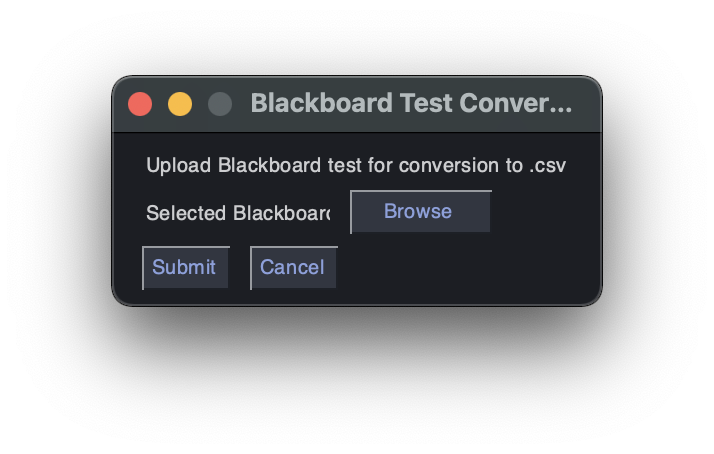

# Documentation

## Navigating Concerto

This section will provide the necessary information to equip users to navigate the Concerto platform. The Concerto platform consists of 7 tabs and this section will break down each individual tab and its functionality.

## 1.1 Tests

This is the brain of your web app. Any given test can take a set of input parameters, perform a set of tasks and then output a set of return variables. These three components are described in detail below as Test Inputs, Test Logic and Test Outputs respectively.

## 1.2 Test Wizards

This tab allows the user to define more complex input methods for each parameter

value but are otherwise cosmetic in nature, allowing you to simplify and save time in complex applications that reuse many of the same functions.

## 1.3 Templates

Templates are pages that will be shown to users during the test execution. Everything that the user sees in their browser window during the test can be determined at the template level. We call them templates because most pages will accept parameters from the test logic and change their look depending on the value of these parameters.

## 1.4 Data Tables

This section of Concerto stores data Tables. Data tables can be used to store anything from test item responses to file paths to demographic information. Each data table has a corresponding table in the MySQL database server.

## 1.5 Files

The Files tab allows you to manage images, documents and any other assets that your test may need to use which are not handled within the tests, data tables or templates sections. It is your library of global, publicly accessible files that can be used anywhere – from your templates to test logic.

## 1.6 Users

The Users tab in the Concerto administration panel is used to determine who has access to that Concerto instance, in other words who can create or edit test content. Users is used in this sense in these guides and is unrelated to any participants that may have completed a test.

## 1.7 Administration

The Administration tab in the Concerto panel contains several sections that can be helpful in monitoring aspects of your Concerto environment. These are explained below.

## Creating a New Grouped Assessment Test

When creating a new Grouped Assessment test there are a few things that must be done in order to ensure that the system works as intended. The first of which is makes sure that the users are authorized under the correct set of users. That is done in the Authorize User Block (See Authorize User Below). Next, the questions must be pulled in from the correct Data Table (See Grouped Questions Below).

AuthorizeUser:

After test start the program must authorize that the intended user is taking the correct test. This is done using the Concerto Authorize User block. To ensure that this block is working correctly, simply navigate to the Data Table tab under the block and select the table of users you would like to use to authenticate.


Questions Data Table:

When running a test it is imperative to ensure that the questions are being pulled from the correct data table location. To make sure that this is the case simply navigate to the Items-Table tag under the groupedAssesment2 block and make sure that the Table-Table is pulling from the correct Data Table.

Quick Debug:

When creating a new test using the groupedAssesment2 block, it is imperative to know that if the test encounters a problem after user authentication, the test might not have 2 of the variables that it needs to process. They might not be initialized. Instead locate the Item Bank Extra Fields - list elements tab under the groupedAssesment2 block and add those variables. Then the code will be able to run effectively. (See below)


### Custom R Code

If it becomes necessary for any reason that the user should have to execute custom R code in order to calculate and processor certain things it is seemingly difficult but quite simple knowing the correct circumstances.

First of all, using the eval block that is built into Concerto the user can evaluate and pass in different variables in order to evaluate that node. For example see the below images


## Rescoring

The client provided us with a file that was formerly used to rescore tests in Rstudio. The client wanted us to import this code into a node in concerto. Test  #86: Reuella Rescoring Test had the data manipulation to pull data from the correct data tables. The code has been partially implemented in concerto. If you go to the rescoring folder, the "concerto_node_rescoring" file has comments that indicate what all has been done and what all needs to be completed. 

## GUI For Converting BlackBoard Test to Concerto

### Dependencies and Software Specification

The Graphical User Interface is built upon Python 3 utilizing the “Less is More” methodology of making the most streamlined workspace for the user.

This Application takes in a folder downloaded from blackboard test export and formats it for import into the concerto adaptive testing framework. The user will select a folder for upload and then let the application run its magic! Simple as that.

This is the requirements.txt that defines the packages required for the python Application

```
numpy==1.21.4
pandas==1.3.4
PySimpleGUI==4.55.1
python-dateutil==2.8.2
pytz==2021.3
six==1.16.0
xmltodict==0.12.0
```




## Executing custom R code

This process is actually incredibly easy and can be done in just a couple of steps.
First of all you are going to want to import the “Eval” block into your workflow as shown below


You can then specify any specific inputs and outputs that you want by clicking on the blue and red output buttons.


Finally simply click on the word eval and type out custom R code into the eval block


There you go 🙂 done and done

## Displaying TraitTheta and Theta

The first thing to do here is to take the groupedAssesment2Node and add a couple of output pieces by clicking the red plus sign. Pictured here:


You’ll then want to connect those via line connection to an eval block to do a little bit of code manipulation. You will click the blue plus button on that eval block and input the traitTheta and theta dynamic input variables. Ignore everything else for now we will discuss the important parts further down.


Next you will create one more eval block and do the same thing with some custom output in order to initialize the intercept and the slope for your theta calculations.


Next you’ll go ahead and connect those to the previously created eval block along with two more dynamic input variables called intercept and slope.


Then we are going to run a bit of code laid out below within that eval block. You will get to this by clicking on the blue ‘eval’ name on the top of the block.

Here is that code:

```r
toReturn = "";
toReturn = paste("Your'e overall score for this test is a ", ((theta * slope + intercept) * 100), "% <br><br>");
for (i in 1:length(traitSem)) {
  toReturn = paste(toReturn, "Trait name: ", names(traitSem)[i]);
  toReturn = paste(toReturn, " with a score of: ", ((traitSem[[i]] * slope + intercept) * 100.0), "% for this question <br>");
}
```

Go ahead and past that into the code - R code area and then we can move onto the final step.

Create another dynamic output on that eval block called “toReturn” it is very important that it has that exact name with the same capitalization.

Then create a showPage block and connect the logical flow of the test to it after the eval block as well as connecting the previous toReturn variable to a new dynamic input variable on the showPage called “toReturn”.


Finally edit the content area of the showPage with whatever HTML you would like to show to your test takers and you’ll be on your way 🙂. (to show the toReturn variable simply put {{toReturn}} anywhere in the html code)

Attached here is the html that we are using to show you how to do that.

```html
Congratulations, you have completed the test! Your professor will work on calculating the grade once everyone has completed their test. Have a nice day!
Thank you for participating in the test. Your scores are as follows: 

{{toReturn}}
```

Attached below as well is a full image of our workflow to give you an idea of the setup for displaying to the test takers. Hope this helps 😃 - CATT Team


# Concerto Adaptive Testing GUI

## About

This program is designed to take raw files generated from Blackboard's tests and convert that into a correctly formatted csv file to uploaded into Concerto. This is to limit any interactions a professor would have with handling Concerto themselves. Concerto tends to have too many bells and whistles that the average professor should need to worry about. “User” and “professor” will be used 

## Usage

1. The professor would need to download the test they want to enter into Concerto. They then need to unzip the folder and put it in a location they will remember it
2. Open the CATT program, select **Browse** and go to your Blackboard test folder you downloaded in the previous step. The prompt next to the **Browse** button should update to the folder path to your Blackboard 
3. Once you’ve checked that the path matches where you stored your Blackboard folder, click the **Submit** button
4. Now a new window will appear that will prompt you if want the file to be converted into a CSV as is or if you want to revise the file before you convert into a CSV. Clicking the **Later** button will produce the CSV file with questions pulled from the Blackboard download and finish the process. Selecting the **Now** button will produce a new screen to preview and edit the CSV
5. The new window from selecting **Now** will show you all editable data from your Blackboard test. Look through the different characteristics of the each column to see if they match your needs. The user will only be able to view 10 questions at a time. Go to the next tab to view the next 10 questions. Refer to the **Edit Page** portion to gain an understanding of each column.
6. After approving of the test data, hit the **Submit** to turn it into a CSV file
7. Upload this CSV file to Concerto and you have completed your process. 🙂

## Edit Page


This page allows for the user to edit different attributes to each question.

### Needed For Concerto. Do Not Edit

### *ID*

### *Trait*

### *Question*

Contains the question for this problem. Change the text within the <p> and </p>. Please do not delete the quotations and the p tags.

```
"<p>What 2 components are analyzed in this lab? </p>”
```

### *Response Options*

Contains the possible responses available for the corresponding question. The responses are nested inside of the text and are highlighted blue in the text below. Everything inside the quotation marks following the keyword label and preceding the coma is the multiple choice response option and number following the keyword value and preceding the coma is that response’s order that it will appear in the test (think if the value is 1, then this will be option A)

Please refrain from removing the quotation marks and the keywords such as “type” and “options” and other words that not highlighted. Only change the text within quotation marks following the keyword label and the number value within quotation marks following the value keyword

```
"{""type"":""options"",""optionsRandomOrder"":""1"",""options"":[{""label"":""Reliability and construct validity"",""value"":""1""},{""label"":""Factor Analysis &amp; ANOVA"",""value"":""2""},{""label"":""ANOVA &amp; Reliability"",""value"":""3""},{""label"":""Construct Validity &amp; Chronbach Alpha"",""value"":""4""}],""defaultScore"":""0"",""scoreMap"":[{""value"":""1"",""score"":""1"",""trait"":null}]}"
```

### P1-4

The columns labeled *P1-4* are used to calculate the weight each response has (response 1 has the weight from ***P1*** and so on)

### *SubGroupId*

Manages what questions are related to each other, i.e. which questions either build off one another or which questions follow the same topic. 

### *SubGroupSortOrder*

*S*pecifies what order these questions within each subgroup should appear in. Directly relates to ***SubGroupId***

The first row from the image above will create a question to look similar to:

What 2 components are analyzed in this lab?

- [ ]  Reliability and construct validity
- [ ]  Factor Analysis & ANOVA
- [ ]  ANOVA & Reliability
- [ ]  Construct Validity & Chronbach Alpha

Since all the values from ***P1-4*** remained at value 1, each response hold the same weight of 1

### Creating A New Executable

If changes were made to the code, then the need to update the executable will be necessary.  To do so is very [simple](https://pypi.org/project/pysimplegui-exemaker/). The GUI was made exclusively with PySimpleGUI and included inside of the requirements.txt is a library that allows the creation of a .exe file (`pysimplegui-exemaker`). Run the command in the terminal of the project

```
python -m pysimplegui-exemaker.pysimplegui-exemaker
```

This will prompt the following screen, where the file location of the code should be placed in the “Source Python File” and the icon image file should be placed below it. The image file must be an ICO image, which can be made from any PNG or JPG image at this [link](https://icoconvert.com/). The executable will be produced inside of the directory where the file is located. Feel free to move the executable anywhere on your computer


### Miscellaneous Details

There certainly are spots where the executable can be improved upon. For example, only showing the necessary information when displaying what can be edited, splitting the ***ResponseOptions*** column to show each question in its own column to avoid the over crowdedness from the current column, along with only showing the responses (***ResponseOptions → ResponseOption1, ResponseOption2, etc.***)

When downloading the files from Blackboard, the files will be DAT files, which a computer (at least a Windows computer) won’t know how to open. Change the file to an XML file (change the .DAT to .xml) to be able to view it yourself. The code provided works with a DAT file, you do not change the file to XML for it to work in this program. This is so you can view it.